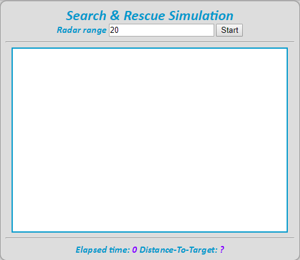
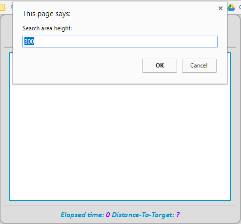
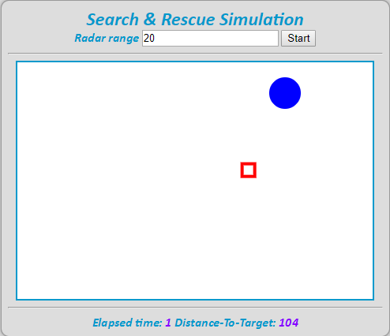
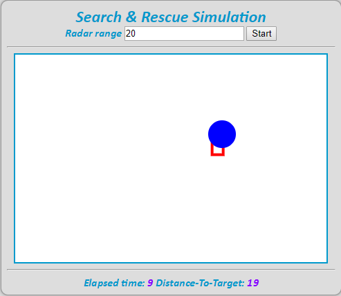

# Search-Rescue-Simulation
A simple Search-and-Rescue simulation done in HTML/JavaScript

## Introduction
Suppose that we are faced with a situation where a still boat has alerted emergency to a nearby harbour. This simulation's task is to play the role of a radar that will detect the exact location of this boat.  
 
The limitations that this radar inculude are:
1. the area that this radar will search is bounded; i.e. it will "bounce" off if it hits the edge
2. the radar can only move in a straight path

Once its mission is complete and was able to detect the boat, it will halt its motion and will display how much time (in sec) it took the radar to detect the boat.

## Pre-requisites and Requirements
- Web programming languages: HTML, CSS, JavaScript
- Web Browser; double click: `SR.html`
- Alternatively, click <a href="https://htmlpreview.github.io/?https://github.com/techGIAN/Search-Rescue-Simulation/blob/master/SR.html" target="_blank">here</a>.

## Screenshots
 
 

## Other Notes
1. You can set how big or small the area of search is.
2. As you know, the initial positions of the boat and the radar are arbitrarily random.
3. <b>Did You Know</b>: This is one my lab projects when I was in first year. Clearly, I was this amazed and proud of my project that I had to put it up here.

## License
**MIT License**   
A short and simple permissive license with conditions only requiring preservation of copyright and license notices. Licensed works, modifications, and larger works may be distributed under different terms and without source code.
